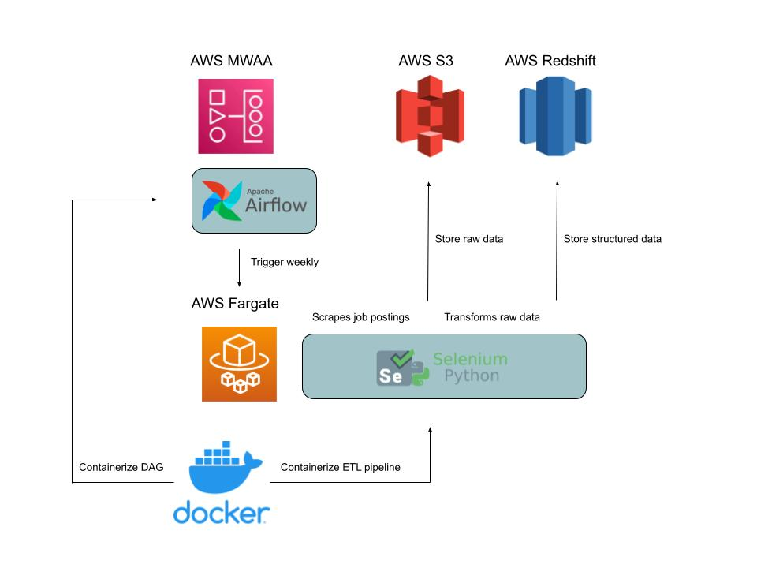

# Job Extraction Pipeline

Software engineering is one of the most in-demand, highest paying jobs currently. There's lots of room for growth and the industry is expected to grow by 25% through the next decade according to the Bureau of Labor Statistics <https://www.bls.gov/ooh/computer-and-information-technology/software-developers.htm>. But this industry is constantly changing and new positions are opening up all the time. This project aims to track the number of positions open for the various specialities within software engineering so that aspiring software engineers can pivot into growing fields, learn the necessary skills, and get a job with a good growth outlook.

## Technologies:

* Python (Selenium, Boto3, Pandas, Psycopg2)
* AWS (S3, Fargate, MWAA, Redshift)
* Airflow
* Docker



## Overview of Docker

Docker is a platform that enables developers to build, deploy, run, update, and manage containers. Containers are a package of software that includes everything needed to run an application: code, dependencies, etc. Containers are isolated from each other and can be ran in different environments (Windows, macOS, GCP, etc.). They allow reproducibility, local experiments, and running pipelines on the cloud.

### General Workflow
Dockerfile: a text file you create that builds a Docker image.  

Docker image: a file containing instructions to build a Docker container.  

Docker container: a running instance of a Docker image
* Since a Docker image is just a snapshot, any modifications performed in the container will be lost upon restarting the container  

Docker compose (docker-compose.yml): a file to deploy, combine, and configure many Docker images at once.  

Dockerfile -> (build) -> Image -> (configure) -> docker-compose.yml -> (run) -> Container  

Docker volume: file system mounted on Docker container to preserve data generated by the running container (stored on the host, independent of the container life cycle.  

“Docker rule” is to outsource every process to its own container.  

## Overview of Airflow

Apache Airflow is the most popular data workflow orchestration tool.  

## How to Setup and Deploy Dashboard

### 1) Setup AWS Infrastucture

The AWS management console is used to set up the AWS infrastructure (S3, Fargate, MWAA, Redshift).  

#### Instructions

1. Get AWS keys by following these steps:

    - Sign into AWS console
    - Click on your username
    - Click on `Security credentials`
    - Scroll down until you see `Create access key` and click on it  

2. Create a `.env` file in the main directory. This file will store all the confidential information for running the data pipeline. Enter your AWS access keys into the file as follows:

    - AWS_ACCESS_KEY_ID = `aws_access_key_id`
    - AWS_SECRET_ACCESS_KEY = `aws_secret_access_key`

3. Setup Redshift cluster:

    - Sign into AWS console
    - Go to search bar and lookup `Redshift`
    - Click on the left side panel and select `Clusters`
    - Click `Create cluster`: Cluster identifier = `indeed-scraper-redshift-db`, Usage: `Free trial`, User name: `username`, Password: `password`

4. Save the Redshift cluster credentials in `.env` file:

    - AWS_REDSHIFT_MASTER_USERNAME = `username`
    - AWS_REDSHIFT_MASTER_PASSWORD = `password`
    - AWS_REDSHIFT_DATABASE_NAME = `dev` (default name, can change later)
    - AWS_REDSHIFT_PORT = `5439` (default port, can change later)
    - AWS_REDSHIFT_HOST = `host` (Endpoint URL, remove port and database name from URL)

6. When a Redshift cluster is created, it's locked down by default so nobody has access to it. To grant other users inbound access to a Redshift cluster, you associate the cluster with a security group. To do this, follow these steps:

    - Locate cluster in Redshift
    - Click on `Properties`
    - Under `Network and security settings` is the `VPC security group` (click on the blue hyperlink)
    - Click on `Inbound rules` and `Edit inbound rules`
    - Click `Add rule` and select the following for the new rule: Type = `All traffic`, Source: `0.0.0.0/0`
    - Click `Save rules`
    - Also under `Network and security settings`, click `Edit`
    - Under `Publicly accessible`, check off `Turn on Publicly accessible`

7. In order to run queries in the Redshift cluster, an IAM user must be created by doing the following:

    - Locate cluster in Redshift
    - Click on `Properties`
    - Under `Cluster permissions`, click `Manage IAM roles` and `Create IAM role`
    - Select `Any S3 bucket` and click `Create IAM role as default`

8. Setup S3 bucket:

    - Go to search bar and lookup `S3`
    - Click on the left side panel and select `Buckets`
    - Click `Create bucket`: Bucket name = `indeed-scraper-s3-bucket`

9. Save the S3 bucket name to `.env` as:

    - AWS_S3_BUCKET_NAME = `indeed-scraper-s3-bucket`

10. Depending on where you are located, input the AWS region whose servers you want to send your requests to by default in the `.env` file:

    - AWS_DEFAULT_REGION = `us-east-1`

### 2) Test and Deploy Container to AWS Fargate

AWS Fargate is used to host and execute a container that will: scrape Indeed.com using Selenium, upload the raw job postings to AWS S3, fix structural errors in the raw data, and store the structured data in AWS Redshift.  

The script currently only supports the scraping of Software Engineer jobs. In the future, there is room to scrape other jobs as well. But for now, we will scrape 10 pages of that one job every week.  

At first, I intended to use AWS Lambda to trigger the pipeline to run. However, I realized this wasn't necessary and it only added an extra layer of complexity. I encountered a lot of difficulty running headless Chrome in a container. After days of searching, I stumbled across this repo: https://github.com/umihico/docker-selenium-lambda. The repo provides a Dockerfile that builds a container which runs headless-chrome using the AWS Lambda RIE (Runtime Interface Emulator). Even though AWS Lambda isn't being used, this Dockerfile provides a convenient way to Dockerize my Selenium web crawler for deployment to AWS Fargate.  

#### Data Pipeline Overview

1. The pipeline starts by executing `get_page_links`, which takes 3 parameters: job title, location of job, and number of pages to scrape. It takes these parameters and generates the Indeed links to each page that is to be scraped.  

2. Each page contains links to the job postings. `get_job_links` is used to grab all the job links on a given page.  

3. The job links are then given to `upload_to_s3` which will call the `scraper` function on each job link to extract all the text from the given job post. It will save the job post as a text file to an s3 bucket. This s3 bucket will serve as a data lake. This function will also return a list of each job posting as a string.  

4. `transformer` is called on the job post strings to extract the job title and the date when the job post was scraped. Each job will be stored in a list as these two attributes.  

5. Then a connection to redshift is established and a table, if it doesn't already exist in the redshift cluster, is created in the `upload_to_redshift` function. Each job's attributes from before are inserted into the table.

    * AWS Redshift is essentially a PostgreSQL database, so psycopg2 was used to connect to the Redshift cluster. To do this, 5 parameters were given: `database name`, `port`, `master username`, `master password`, and the `host` name. These parameters are located in the `.env` file that we generated earlier. These parameters are passed into the container as environmental variables when the container is run.  

#### Test Instructions

1. Build the image for the data pipeline:

```bash
docker build . --tag scraper:latest
```

2. Run the image (replace the dummy values with your values in the `.env` file)

```bash
docker run \
    -p 9000:8080 \
    --name scraper \
    AWS_ACCESS_KEY_ID=`aws_access_key_id` \
    AWS_SECRET_ACCESS_KEY=`aws_secret_access_key` \
    AWS_REDSHIFT_MASTER_USERNAME=`username` \
    AWS_REDSHIFT_MASTER_PASSWORD=`password` \
    AWS_REDSHIFT_DATABASE_NAME=`database_name` \
    AWS_REDSHIFT_PORT=`port` \
    AWS_REDSHIFT_HOST=`host` \
    AWS_S3_BUCKET_NAME=`bucket_name` \
    AWS_DEFAULT_REGION=`aws_region` \
    scraper:latest
```

3. Delete the image and container (when they are no longer needed)

```bash
docker kill scraper
docker rm scraper
docker image rm scraper:latest
```

### 3) Test and Deploy Airflow DAG to AWS MWAA

Airflow is used to orchestrate the lambda function. Every week, the DAG will trigger the data pipeline to scrape Indeed for new Software Engineering job postings. Each job posting will be saved as a .txt file in an S3 bucket. The S3 bucket will serve as a data lake. Then the raw data will be transformed using PySpark and uploaded to AWS Redshift. The DAG was developed and tested on a local machine using https://github.com/aws/aws-mwaa-local-runner. Then, the DAG was deployed to AWS MWAA.

#### Steps

1. Build the Docker container image using the following command:
```bash
./mwaa-local-env build-image
```

2. Runs a local Apache Airflow environment that is a close representation of MWAA by configuration.
```bash
./mwaa-local-env start
```

*To stop the local environment, Ctrl+C on the terminal and wait until the local runner and the postgres containers are stopped.*

3. Access the Airflow UI

By default, the `bootstrap.sh` script creates a username and password for your local Airflow environment.

- Username: `admin`
- Password: `test`
- Open the Apache Airlfow UI: <http://localhost:8080/>.

4. Add DAGs and supporting files

- Add DAG code to the `dags/` folder.
- Add Python dependencies to `requirements/requirements.txt`.
    * To test a requirements.txt without running Apache Airflow, use the following script:
    ```bash
    ./mwaa-local-env test-requirements
    ```
- Add custom plugins to the `plugins/` folder.